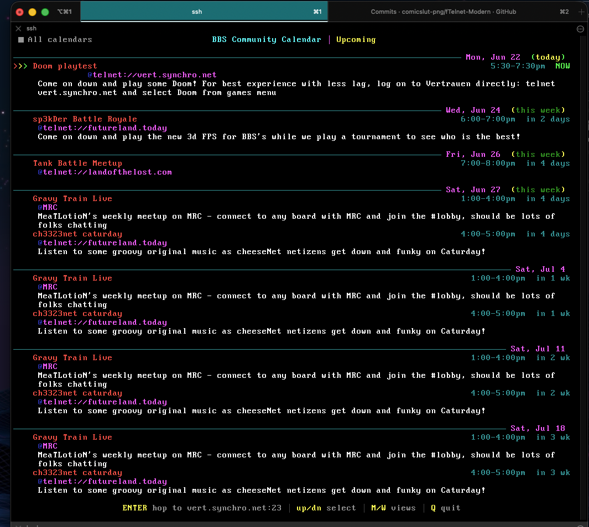
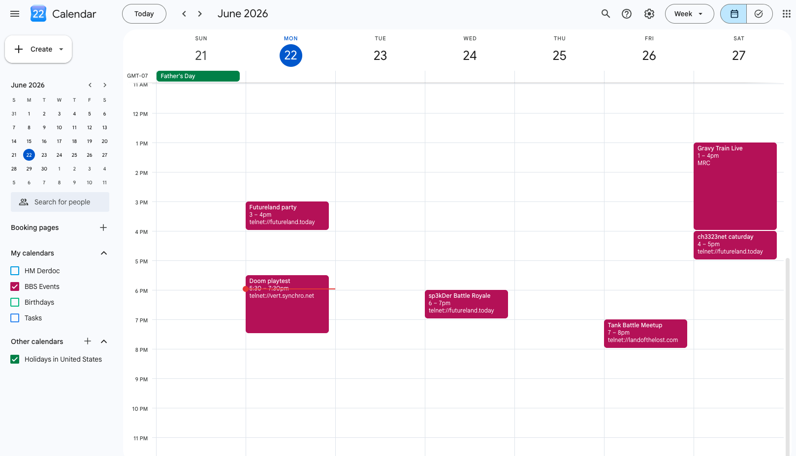
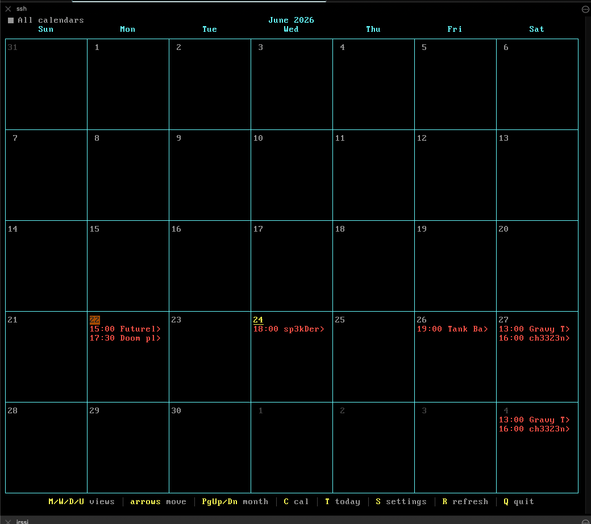
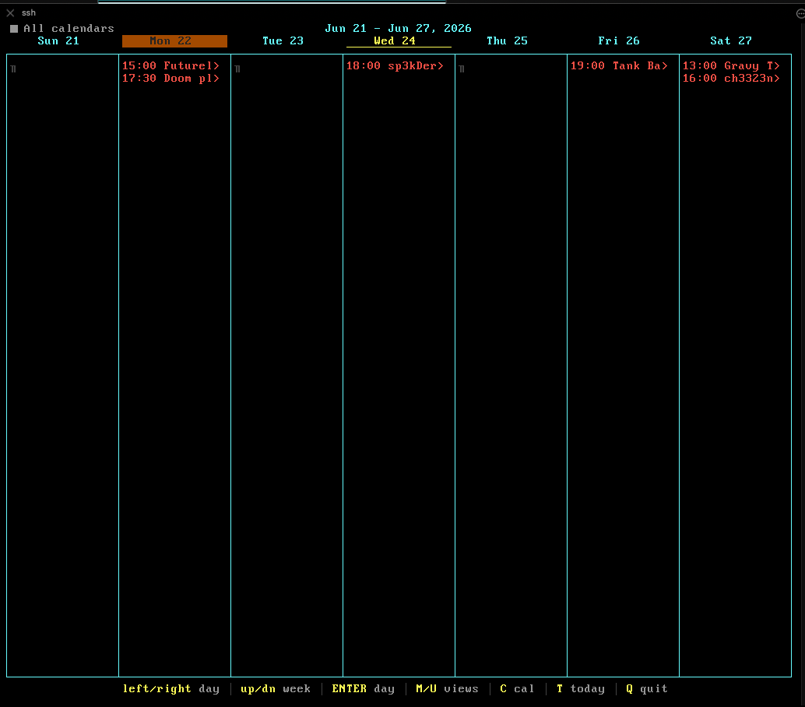
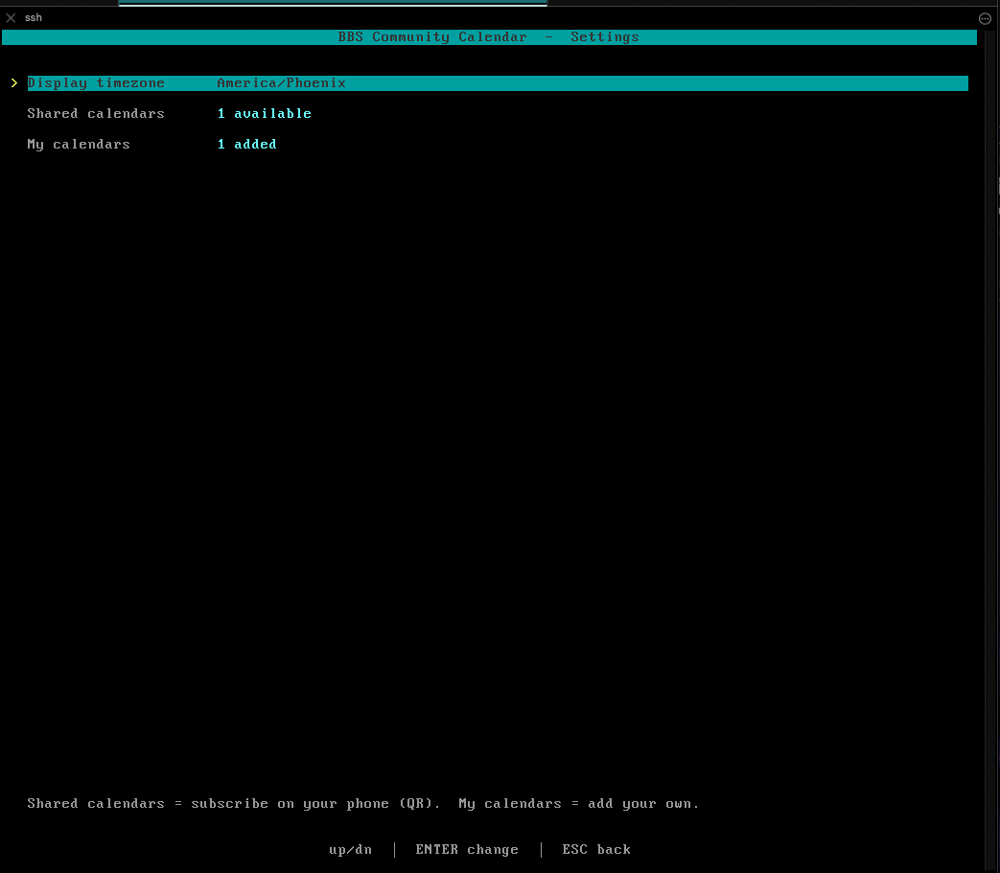

# CalenDoor

A calendar door for the BBS - any board that serves a `DOOR32.SYS` dropfile
(Synchronet, Mystic, ENiGMA½, Talisman, WWIV, and more), on Windows, Linux,
macOS, or FreeBSD. It subscribes to public iCalendar (`.ics`) feeds and renders
them as month / week / day / upcoming views, color-coded per calendar, right in
the terminal - so your whole board can see what's happening and when.

It's **read-only**: you keep creating and editing events in Google Calendar,
iCloud, Outlook, or wherever you already do. CalenDoor just subscribes and
displays. Nothing to write back, no accounts, no database.



You keep events where you already do; the door renders the public feed on your
board. Same events, in Google Calendar and in CalenDoor:



## Features

- **Four views** - Upcoming agenda (default), Month grid, Week grid, Day agenda.
  Grids scale to the terminal: a bigger window shows wider cells and more events
  per day.
- **Multiple calendars, color-coded** - run as many feeds as you like; each gets
  a color across every view. Press **C** to cycle/filter to a single calendar.
- **Live digital clock splash** - a TheDraw-font LCD clock on entry (font and
  color configurable).
- **Telnet gateway (TELGATE)** - if an event is happening **NOW** and its
  location is a `telnet://` address, callers can hop straight to that BBS from
  the door and back. Great for cross-board events, door tournaments, and watch
  parties. Events that point at *your* board show **HERE NOW** instead.
- **Per-caller timezone** - each caller picks their zone once; events render in
  their local time and the choice persists.
- **Personal calendars** - a caller can add their own private feeds, shown only
  to them, layered over the shared board calendars.
- **Phone subscribe (QR)** - any shared calendar can be opened on a phone by
  scanning an on-screen QR code, so events follow callers off the board with
  native reminders.
- **Responsive** - re-lays out live when the terminal is resized.
- **Auto-refresh** - re-fetches feeds in the background on an interval; input
  never blocks on the network.

## Screenshots

**Month** - the grid scales to the terminal; today is highlighted, events are
color-coded per calendar.



**Week** - a column per day for the focused week.



**Settings** - per-caller timezone, shared calendars (phone-subscribe), and the
caller's own personal feeds.



## Getting it

Grab the archive for your platform from the
[Releases](https://github.com/hmderdoc/CalenDoor/releases) page and unzip it
wherever you keep your door programs.

| Platform | Archive | Notes |
|---|---|---|
| 64-bit Windows | `..._windows_amd64.zip` | Windows 10/11, Server 2016+ |
| 32-bit Windows | `..._windows_386.zip` | Windows 7/8/10/11 (32-bit) |
| 64-bit Linux | `..._linux_amd64.tar.gz` | most servers |
| 32-bit Linux | `..._linux_386.tar.gz` | older / embedded |
| ARM Linux | `..._linux_arm64.tar.gz`, `..._linux_arm.tar.gz` | Raspberry Pi etc. |
| macOS | `..._darwin_arm64.tar.gz`, `..._darwin_amd64.tar.gz` | Apple Silicon / Intel |
| FreeBSD | `..._freebsd_amd64.tar.gz` | |

Each archive contains `calendoor` (the door), `calendar.ini.example`, and this
README. The binary is self-contained - the IANA timezone database and the
TheDraw font library are embedded, so there are no runtime assets to ship.

Prefer to build it yourself? With Go 1.25+:

```sh
git clone https://github.com/hmderdoc/CalenDoor
cd CalenDoor
go build -o calendoor ./cmd/calendoor
```

## How the door connects

CalenDoor is a standard DOOR32 door and runs on **any BBS that emits a
`DOOR32.SYS` dropfile** - Synchronet, Mystic, ENiGMA½, Talisman, WWIV,
DoorParty-style launchers, and others. It picks its connection automatically:

1. **Socket mode (DOOR32.SYS).** If the dropfile says the caller is on a socket
   (comm type `2`), the door takes over that handle directly - an inherited file
   descriptor on Linux/Unix, a Winsock handle on Windows.
2. **Standard I/O mode.** With no socket dropfile, the door talks over
   stdin/stdout - for setups that pipe the telnet session to the door's standard
   I/O (FOSSIL-to-socket bridges, redirector front-ends).

By default it reads `DOOR32.SYS` from the working directory; point it elsewhere
with `-dropfile <path>` or the `CALENDAR_DROPFILE` environment variable. The
door auto-detects the terminal size and re-lays-out live when the window resizes.

## Setting it up on your BBS

Add CalenDoor to your external programs menu the same way you'd add any
DOOR32-style door. Put `calendoor` and your `calendar.ini` (see below) in a
directory, then:

### Synchronet

In `SCFG -> External Programs`, add a program with the command line `?calendoor`
(or the absolute path to the binary). Recommended settings: **Native
executable**, **no I/O intercept**, and have Synchronet **place a DOOR32.SYS in
the node directory** (the same options you'd use for any native socket door).
The door reads the inherited telnet socket from `DOOR32.SYS`.

### Mystic

In the door editor, set the command line to the binary and enable a
`DOOR32.SYS` dropfile for the node, e.g.:

```
Command Line : /mystic/doors/calendoor/calendoor
Dropfile     : DOOR32.SYS
```

### Generic DOOR32 BBS

1. Configure the door to **write a DOOR32.SYS** into the node/work directory.
2. Launch `calendoor` from that directory (or pass `-dropfile <path>`).
3. The door reads the socket handle from the dropfile.

### stdio-redirector front-ends

If your setup pipes the telnet session to the door's standard input/output
instead of handing over a socket, just launch `calendoor` with no dropfile and
it uses stdin/stdout.

`calendar.ini` is read from next to the binary (or the working directory). No
BBS restart is needed to pick up `.ini` changes - the next caller gets them.

## Configure

Copy `calendar.ini.example` to `calendar.ini` and edit. The `[settings]` block
holds the title, week start, timezone, refresh interval, telnet gateway toggle,
this board's host, and the clock font. Full documentation is inline in the
example file.

### Shared calendars (the whole point)

Every `[calendar]` section adds a feed that **everyone on the board** sees:

```ini
[calendar]
name  = BBS Events
url   = https://calendar.google.com/calendar/ical/.../public/basic.ics
color = red
```

`url` must be a **public iCalendar (`.ics`) feed**:

- **Google:** Calendar settings -> *Integrate calendar* -> *Secret address in
  iCal format* (or *Public address* if the calendar is fully public). If you
  want others to add events, share the calendar with their Google account as
  *Make changes to events* - that's a Google permission, not a door feature.
- **iCloud:** share a calendar *Public*, copy the `webcal://` link (works as-is).
- **Outlook:** calendar settings -> *Publish* -> the ICS link.

Add as many as you want; `color` color-codes each one and callers press **C** to
filter between them. The example ships with a shared **BBS Events** calendar and
**US Holidays** so multi-calendar and filtering work out of the box.

### Telnet gateway

With `telnet_gate = on`, an event whose **location** is `telnet://host[:port]`
becomes a one-keypress hop while it's live: callers see **JOIN NOW**, press
ENTER, land on that board, and return to the door when they disconnect. Set
`host` to your own telnet address so events pointing back at you read **HERE
NOW** (and greet callers on login) instead of trying to hop to yourselves.

### Theming

The `[colors]` block restyles the whole door - weekday header, day numbers,
today's highlight, titles, grid borders, footer keys, and the splash clock. Use
any of: `black red green yellow blue magenta cyan white`, their `bright*`
variants, plus `gray/orange/pink/purple/teal/lime`. You can also give each month
its own accent color:

```ini
[colors]
today  = lime
clock  = lightred                                       ; classic alarm-clock red
months = cyan,magenta,green,yellow,green,cyan,red,yellow,orange,red,orange,blue
```

`clock_font` (in `[settings]`) picks the splash clock's TheDraw font by name -
`computrx` (default), `digitx`, `digital2`, or any other bundled font.

## Sharing your calendar

The calendar list in `calendar.ini.example` is meant to be **shared**. If you run
a board and want other sysops to be able to subscribe to your public events,
open a pull request adding your `[calendar]` block to `calendar.ini.example`:

```ini
[calendar]
name  = Your Board Name
url   = https://.../public/basic.ics    ; a PUBLIC ICS feed
color = magenta
```

Keep it a genuinely public feed (no private/secret addresses you don't want
shared), and that's it - anyone who pulls the example gets your calendar. Sysops
who'd rather not be in the shared list just add calendars to their own
`calendar.ini` locally; both work the same way.

## License

MIT - see [LICENSE](LICENSE).
